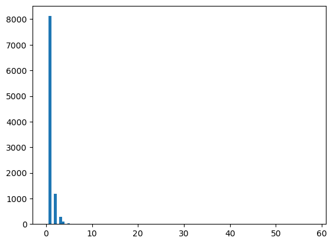
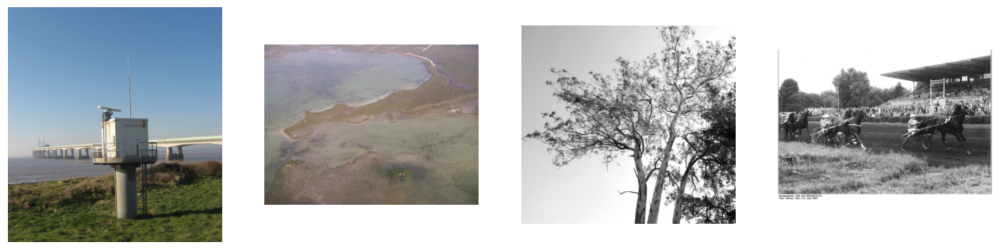

# VisionMark AI

### An AI-Powered Deep Learning System for Real-World Landmark Recognition (Transfer Learning with VGG19)

A convolutional neural network that identifies landmarks (e.g. bridges, monuments, natural sites) from photographs, built with transfer learning on top of **VGG19** pretrained on ImageNet.

## Overview

Given a photo, this project classifies it into one of thousands of landmark categories from the [Google Landmarks Dataset v2 (GLDv2)](https://github.com/cvdfoundation/google-landmark) — the dataset behind Kaggle's [Google Landmark Recognition](https://www.kaggle.com/c/landmark-recognition-2020) competition.

**Approach:**
- Use VGG19's convolutional base (frozen, ImageNet weights) as a feature extractor
- Add a `GlobalAveragePooling2D` + `Dense(softmax)` classification head
- Train with batch-wise loading (images are read and preprocessed on the fly, since the full dataset doesn't fit in memory)
- Evaluate on a held-out validation split

This repo currently demonstrates the **full pipeline end-to-end** on a small subset of the data (500 images, 1 epoch) as a proof of concept — see [Scaling up](#scaling-up) for what's needed to train a production-grade model.

## Dataset

| | |
|---|---|
| Source | [Google Landmark Recognition (Kaggle)](https://www.kaggle.com/c/landmark-recognition-2020) |
| Format | `train.csv` (`id`, `url`, `landmark_id`) + images stored at `images/{a}/{b}/{c}/{id}.jpg`, where `a,b,c` are the first 3 characters of the image ID |
| Classes used here | Subset filtered to IDs starting with `00`/`01`, for a manageable download size |

**Class imbalance is severe** — most landmark classes have only a handful of images:



Sample images from the dataset span a wide range of subjects — bridges, coastlines, trees, historic photographs:



## Setup

```bash
git clone <your-repo-url>
cd visionmark-ai
pip install -r requirements.txt
```

Download the dataset from Kaggle and place it as:

```
data/
├── train.csv
└── images/
    └── 0/1/2/.../<id>.jpg
```

Then open `Landmark_Det.ipynb` and run the cells top to bottom.

## Model architecture

```
VGG19 (frozen, ImageNet weights, include_top=False)
    → GlobalAveragePooling2D
    → Dense(num_classes, activation='softmax')
```

Trained with `RMSprop` and sparse categorical cross-entropy loss.

## Scaling up

This notebook proves the pipeline works; it isn't a fully trained model yet. To take it further:

- Remove the sample cap and train on the full filtered dataset (or the entire GLDv2 dataset)
- Train for more epochs with early stopping, rather than a single pass
- Unfreeze the top few VGG19 layers and fine-tune at a lower learning rate
- Evaluate every epoch (currently only evaluated once, after training) to track overfitting
- Consider a lighter backbone (MobileNetV2, EfficientNet) for faster training on limited hardware
- Handle class imbalance explicitly (class weighting or oversampling rare landmarks)

## Tech stack

- Python, TensorFlow / Keras
- OpenCV, Pillow for image I/O and preprocessing
- pandas, NumPy, scikit-learn
- Matplotlib for visualization

## Project structure

```
.
├── Landmark_Det.ipynb   # main notebook: EDA, model, training, evaluation
├── requirements.txt
├── repo_assets/         # images used in this README
└── data/                # dataset (not included; see Setup)
```
